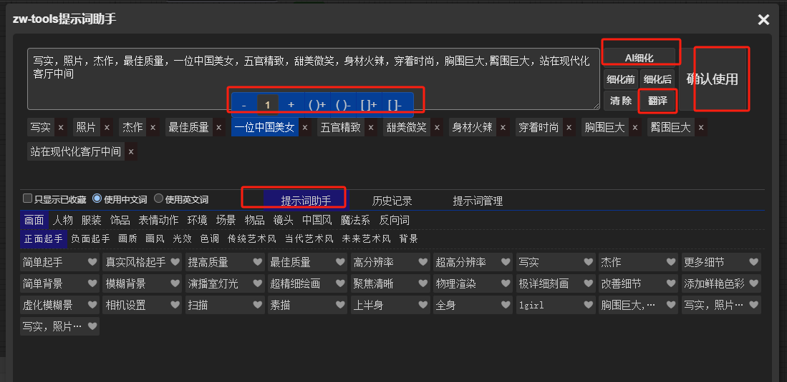
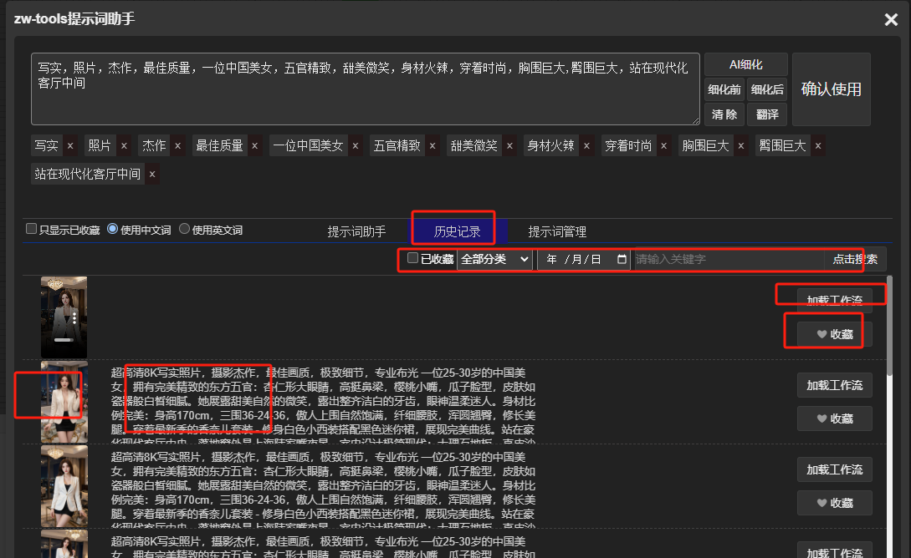
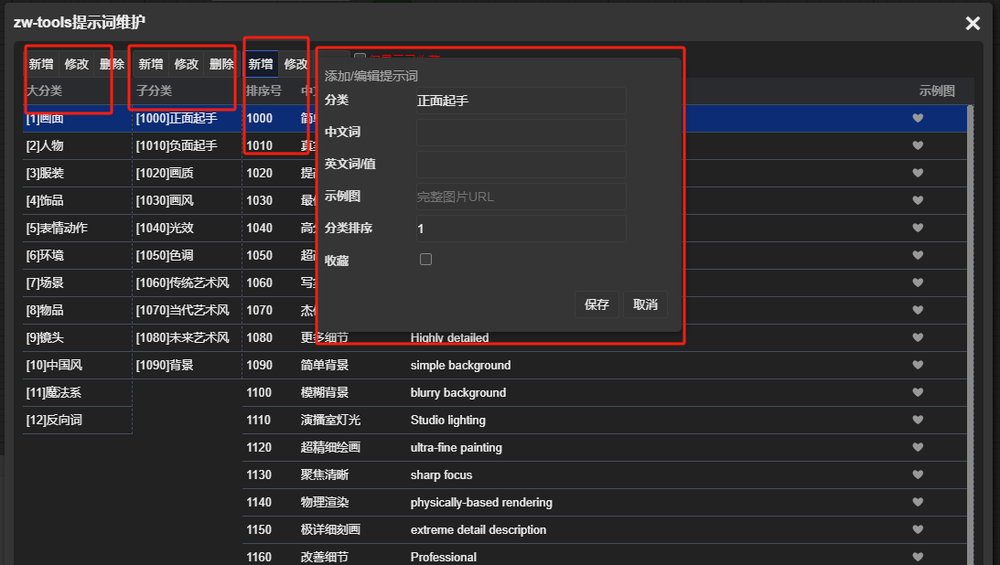
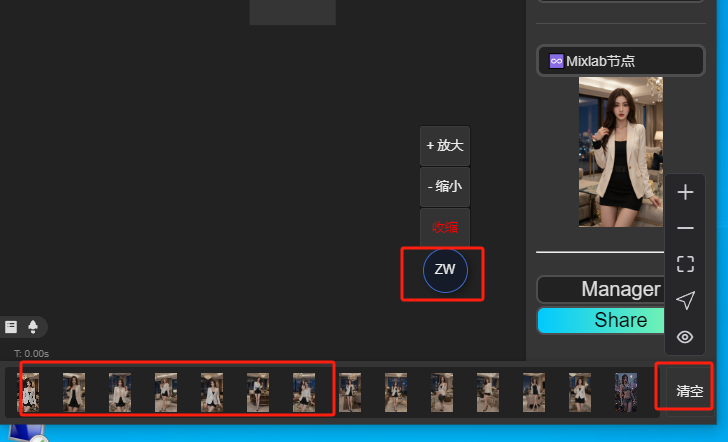
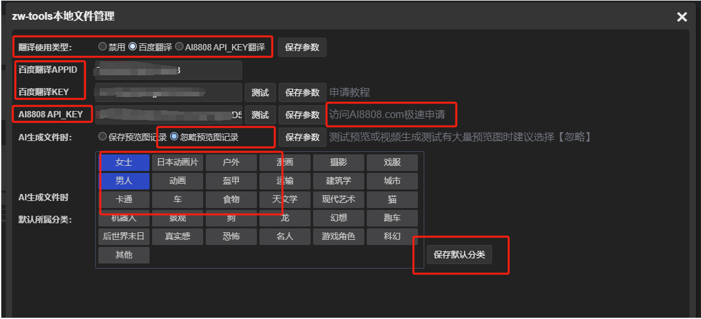

# ComfyUI-zw-tools
ComfyUI插件，提示词自动翻译成中文，提示词自定义管理，提示词AI扩写和AI翻译，AI生成图片或视频记录管理（文件浏览器），文件上传至云端存储管理

## 更新记录20251201
1. 修正3.7.5版本时输入框双击无效的问题BUG
2. 提示词节点新增是否开启翻译的便捷开关:方便在中文提示词和英文提示词直接切换

## 觉得好用请帮忙点点小星星, 觉得不好用可以给我留言或一笑而过...

## 功能介绍
1. 提供两个自定义文本节点: 可以直接输入中文，执行生成时自动翻译成英文输出，一个带CLIP一个不带CLIP
2. 两种翻译选择：百度翻译和www.AI8808.com API接口翻译（DeepSeek AI翻译）
3. 提示词助手：常用提示词收集整理使用、提示词权重便捷设置、提示词可以使用DeepSeek AI扩写细节
4. 提示词UI界面维护管理：可以自行维护常用的提示词详细
5. 图片或视频生成的历史记录管理：可以随时查看历史提示词或工作流，精确到每一张图片
6. 文件管理UI界面：可以管理本地生成的图片或视频，增删改或上传到云端等操作
7. 便捷图片或视频文件查看器

## 安装前提
pip install ffmpeg-python

## 安装
1. 方法一：下载后将ComfyUI-zw-tools文件夹 放置到ComfyUI/custom_nodes目录，而后重启ComfyUI 
2. 方法二：通过ComfyUI-Manager安装
3. 安装后设置 百度翻译的参数 或 设置AI8808的密钥参数（可以同时用于翻译和提示词AI扩写）

## 示例UI图片

